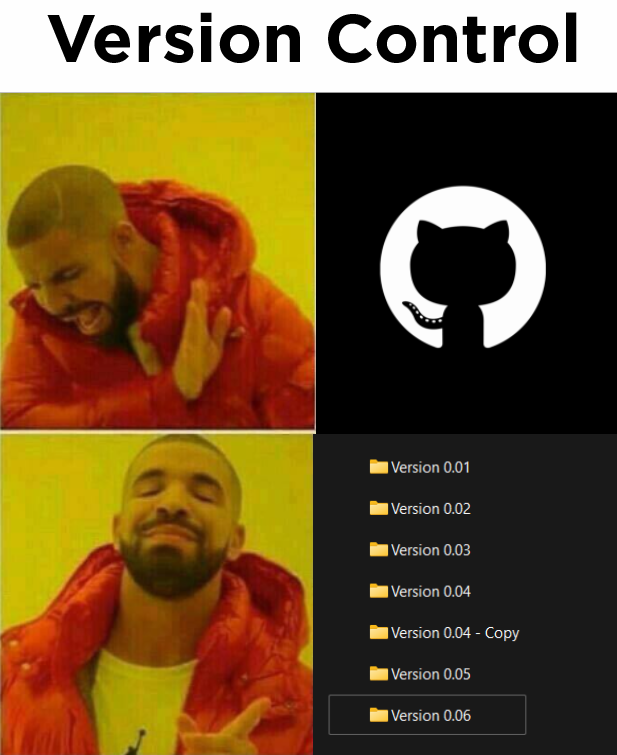
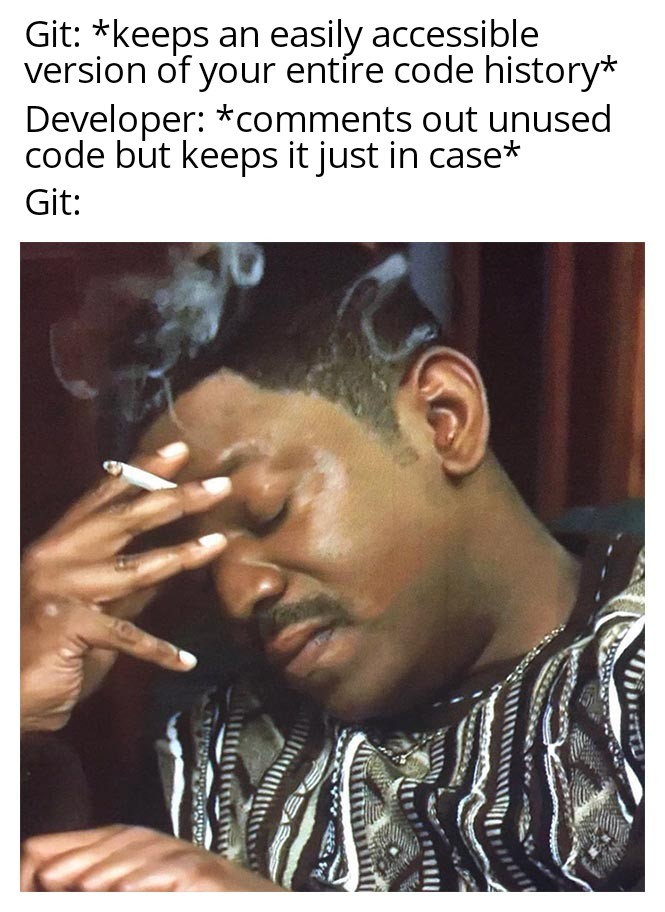
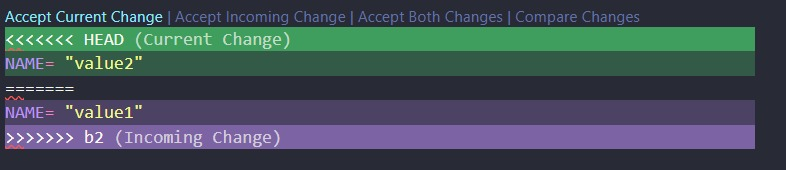
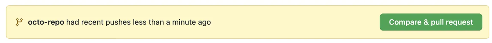

# Guide


## What we expect from your system
- we assume that you have already installed python in your device. 


## Setup
1. install git on your machine. visit [git's website](https://git-scm.com/downloads)
2. install vscode. We recommend this editor [website](https://code.visualstudio.com/)
3. setup remote access to github (https tutorial)

4. clone the repo: run this once git is installed in your system:
```sh
git clone https://github.com/aachen-investment-club/financial-dashboards-workshop.git
```

5. create a virtual environment inside of your project: 
```sh
python -m venv venv
```

6. start the virtual environment with
```sh
.\venv\Scripts\activate
```

7. install the requirements: 
```sh
pip install -r requirements.txt
```
7. we recommend to install the following vscode extensions:
- git graph
- markdown preview enhanced


## Quick `git` tutorial
Let's start with a few classics:  




We all might relate to at least one of the two situations before, no shame on that, nobody starts 
out programming already knowing git. So... why is git so great? 
- **Its an industry standard**. Regardless where you are, if you are writing code in a company, you are using `git`. There is 
simply no other way. 
- **Version control is actually... great!**. With git, you can (almost magically) switch from one version of your code, to another. Even better, you can access your teammates code, almost just as easily. 
- **Conflict resolution is simplified**. Lets say you and your collaborator have two code versions, and you want to update both of your codebases. This is however, very tedious! Imagine having to inspect every single line of code checking for conflicts and code differences. Git helps us finding them and solving them!
- **Access to open source projects**. Ever been interested in contributing to open source projects? That means, `git` is a baseline requirement. Simply stated, if you don't know git, you cannot make your groundbreaking contribution!

So, hoping that this short introduction motivated you a bit, lets get right into it. 


### friendly reminder
Before starting with this part of the workshop, make sure that you have already completed the [system prerequisites](#what-we-expect-from-your-system) and the [setup](#setup) section!


#### Warmup and the commit graph
Git works on **repositories**, which are managed under the hidden folder `.git` in your project's root folder. You can think of a repository as an environment that holds all your local code versions. 

First, we will start by creating your own branch. You will be using this branch for the rest of the tutorial. If you run the command
```sh
git branch
```
a list of branches should pop up, e.g. `main`. Now, run the following command, making sure to substitute your first and last names: 
```sh
git checkout -b <firstname>_<lastname>
```
This command does two things: 
1. it creates the branch `<firstname>_<lastname>`. 
2. it changes your current branch from `main` to `<firstname>_<lastname>`. 

Now, we can start making some changes in our branch. Open the file `example.py`. Here, locate the `NAME` variable and set it to your name. Save your file changes. 

Now, we can perform the two commands you will be using most frequently in all you git projects: 
```
git add .
git commit -m "first commit" 
```
So... What did we just do? `git add .` tells the repository that you want to include all the changes you have recently made in your next commit. With `git commit` you have finally created the **first version** version of your code. You can see this as a checkpoint you can return to any time you want. Note that this does not only affect the current file, but also **all files in your repository**. Quite powerful, right?

Next, let us do a quick experiment. Run the following command: 
```sh
git switch main
```
Go back to the `./pages/example.py` file (you might want to re-open the file). Notice anything different? 
If you did everything right so far, you should notice, that the name you just set is **gone**. 

Don't be scared! Your changes are safe. Run the following command: 
```sh
git switch <firstname>_<lastname>
```
make sure to use the same name you used before! You should see that your changes are back. What did we just do? First, when we switched to main, we changed the HEAD pointer from the latest commit in your branch, to the latest commit in the main branch. Then, when switching back to your branch, you move the HEAD pointer back to the latest commit of your branch. 

HEAD? what is that? This might be a bit abstract. But, if you are able to understand what is to come, you managed to understand git's most basic behavior. Imagine that your each version of your whole codebase is represented by a node in a graph. Looking back into what we have done so far, your graph should like kind of like this: 


Each node in the graph represents some commit (version) of your code. The last commit you made is at the top, and the HEAD is pointing to that commit (this way, you can see the current changes). 

Do you remember when you switched to main? Well, what happened in the background, was that the HEAD pointer was moved to the latest commit of the main branch (the blue nodes): 


Therefore, you could not see your latest changes any more, because you successfully walked back to a previous commit (aka you went back to a previous checkpoint). 

One last comment, HEAD therefore is the responsible of "picking" which version you are currently in, so one of git's most important tasks is learning how to traverse this graph.


#### Merging branches and resolving conflicts
You are almost there. Make sure that you are currently in the main branch. i.e. run `git branch` or directly run `git switch main`. Now, we are going to repeat what we did before: 
1. create a new branch, this time call it "coworker_branch".
2. switch to this branch.  
3. go to the `./pages/example.py` file and edit the `NAME` variable again. **MAKE SURE TO USE A DIFFERENT NAME**.
4. run `git add .` and `git commit -m "some change made by a coworker"`
If you did everything correctly, your tree should now look like this: 


Since you created the new branch while standing on the older commit, the tree is split here. 

Now imagine you are in the following setting. The green branch was actually created (remotely) by one of your coworkers. You would like to synchronize your changes with the ones made by your coworker. Therefore, you would like to *merge* the green and the orange nodes (your version with your coworker's version). This is the main functionality of the `merge` command. Think of it like this: 

“I’m on the branch I want to bring changes into, and I merge in the changes from another branch.”

So, first switch to the target branch, and then run the merge command (therefore, you would like to replace your changes by the ones made by your coworker): 
```sh
git switch <your-branch>
git merge <coworkers-branch>
```
if you see a "merge conflict notification", don't panic! this is intended! Basically, whenever git tries to merge two codebases, it checks file by file if there are any redefinitions, conflicting names, etc. If that is the case, conflict resolution is necessary before finalizing the merge. 

Open the file `./pages/example.py`. You should see the following: 



Simply delete the lines that you don't want to have, and done! Conflict solved. Now run `git add .` and `git commit -m "first conflict resolved` to finalize the merge. 


## Baseline Plotly Project


## Sharing your code with others
So, it is finally time. Assuming you are already in a group with other two people, first, look at your dashboards, and decide which one you would like to use from now on. All of you will be using this dashboard as a basis. Do the following: 

0. Owner: Dont forget to run `git add .` and `git commit`!   
1. The owner of the selected version must push their code to GitHub. 
```sh 
git push -u origin <your-branch-name>
```
Note that when doing this for the first time, i.e. when the branch has not been backed up with Github, this command is necessary. After this, you can simply use `git push`.
2. Now, your collaborators can download your code. For this, they need to run: 
```sh
git fetch origin
git checkout <owner-branch-name>
git pull origin <owner-branch-name> 
```
this is also necessary when pulling a branch for the first time. After the first time, it is enough to run `git pull` to synchronize with the current stand. Note that running `git pull` **might lead** to conflicts, hence resolution might be necessary!
## Workflow when working with others
One last thing, before you start working on your own: there exists a typical workflow when working with others. Here we assume that you and your collaborators have a copy of the same branch in your respective local machines. Here we list a few important standards/ good practices:  

First of all, *BEFORE WRITING ANY CODE* always run `git pull`. This way you ensure to have the latest version of the code and avoid conflict resolution. 

After you are done writing your code, and fully sure it works as intended, run the usual commands to sync with the remote repo:  
```sh
git add . 
git commit -m "some descriptive message summarizing your changes" 
git push
```

Never develop (code) in the main branch. The main branch represents the stable version of your code, therefore, only add new features to it once you are fully sure everything works. Therefore, always create a development branch for your new feature, then test it online, and then, once you are sure, merge with main.


## pull request


If you should never code in main,... how do you merge main with a development branch in my *REMOTE* repository? For this you use *pull requests*. Whenever github sees that `main` is outdated with respect to other online branches, it will prompt you to do a pull request. The workflow is the following: 
1. first, you create the pull request, indicating to the repositor owner that you "feel ready to merge with main"
2. the admins/repo owners will then look at your code, and hopefully, merge with main.


## Now its your turn!